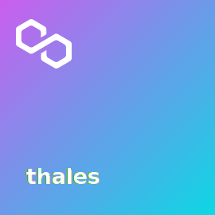

# NFT validation Minter

This projects demonstrate how to sign a message and validate if this message was signed by the msg.sender and if it was it call a NFT mint function that creates a SVG with the message that you signed.



```shell
For testing in root folder
npx hardhat test
For running frontend in client folder
yarn run dev
```
